# Waypoint — Dataverse

A logistics operations platform for Waypoint Group. It connects ordering, planning, loading, delivery and receipt across four roles: **Dispatcher**, **Loader**, **Driver** and **Store Manager**. A fifth role, **Admin**, handles users, fleet, demo data and system health.

Planning is deterministic Java code. It respects the operating rules and explains every deferral. The AI assistant reads system state through role-scoped tools. It never decides access and never mutates data.

> **Status.** The backend, the AI service and the React frontend are built. The frontend covers all four roles and the admin area. The walkthrough below uses the REST API so each call is visible; the same steps can be run in the UI (see the note in the walkthrough).

---

## Contents

1. [Problem and context](#problem-and-context)
2. [Architecture](#architecture)
3. [Data model](#data-model)
4. [Order, trip, delivery and sync lifecycles](#lifecycles)
5. [Planning and allocation rules](#planning-and-allocation-rules)
6. [Setup](#setup)
7. [Seeded accounts](#seeded-accounts)
8. [Judge walkthrough](#judge-walkthrough)
9. [API reference](#api-reference)
10. [Departures from the Designathon](#departures-from-the-designathon)
11. [Testing](#testing)

---

## Problem and context

### The business

Waypoint Group is a Sri Lankan retail group. Three brands share one delivery network out of two depots:

| Brand | Outlets | Goods | Delivery pattern |
|---|---|---|---|
| Waypoint Fresh | 80 | Groceries, chilled and frozen | Daily, before the 8 AM store opening |
| Waypoint Style | 25 | Garments and cartons | Weekly, with seasonal peaks |
| Waypoint Tech | 15 | Appliances and electronics | As needed, high value and fragile |

There are 120 outlets, 2 depots (Peliyagoda and Kandy) and 60 vehicles. Each vehicle has one home depot and serves only that depot's outlets. Chilled capacity is limited to 16 reefer vehicles.

Planning happens by phone call, spreadsheet and printed run sheet. Once a vehicle leaves the depot nobody can see its progress. When an order is deferred there is no structured record of why, so the same outlet can go unserved repeatedly.

### The problem

> "Waypoint needs a system that intelligently coordinates limited delivery capacity across competing brands while respecting real-world operational constraints, keeping every stakeholder synchronized, and using data to anticipate future demand and delivery problems."
> — Challenge Booklet

The brief lists seven problems the system must address:

1. Planning is fragmented, with manual re-entry and tribal knowledge.
2. Delivery progress is hard to track, and problems surface only when the driver reaches the outlet.
3. Deferrals have no clear record, so outlets go unserved repeatedly.
4. Communication does not support feedback. There is no reliable proof of delivery and no pre-departure shortfall flag.
5. Demand is hard to anticipate ahead of paydays and festivals.
6. Service time and lateness are not predicted.
7. Field connectivity is unreliable. The driver app must work offline and reconcile on reconnect.

### Operating rules the allocation must respect

- Every vehicle has a weight cap **and** a volume cap.
- Chilled and frozen goods need a reefer vehicle. Reefers can carry ambient goods, but ambient vehicles cannot carry chilled.
- Each vehicle has a weekly fuel quota that distance consumes.
- A vehicle makes at most two trips per day. Operating days are Monday to Saturday.
- Every outlet has a delivery window. Fresh must arrive before 8 AM.
- Mall outlets can only be served inside the mall's access window.
- Van-only outlets cannot be served by trucks.
- Orders for next-day delivery close at 4 PM the day before.

### The four roles

| Role | Works from | Core need |
|---|---|---|
| **Dispatcher** | Office, large screen, stable connection | One cross-brand order queue, constraint-checked planning, visibility after dispatch, explainable deferrals |
| **Loader** | Warehouse dock, shared tablet | A live stop sequence that matches unload order, shortfall reporting before departure |
| **Driver** | Personal phone, on the road, weak signal | Offline route and stop list, delivery outcome and proof of delivery recorded offline, sync on reconnect |
| **Store Manager** | Outlet counter, desktop or phone | Place orders, see the expected arrival, get deferral notices with reasons, confirm receipt or report a problem |

The end-to-end flow: the store places an order, the 4 PM cutoff closes the queue, the dispatcher plans and approves, and each order either reaches the store (loading, driver, delivery, receipt) or is deferred with a recorded reason that carries into the next cycle's priority.

### How the system responds

| Problem | Response in this build |
|---|---|
| 1. Fragmented planning | One planning engine runs the operating rules and produces a plan the dispatcher can approve or replan |
| 2. Progress hard to track | Trip, stop and delivery states are recorded as events. The dispatcher's monitoring screen and the store's ETAs read from them |
| 3. Deferrals unrecorded | Every deferral stores structured reasons. The next plan prioritises outlets that were deferred or not served recently |
| 4. No feedback or proof of delivery | Delivery outcome records units handed over, a proof-of-delivery reference and a reason for any shortfall. The store confirms receipt and any discrepancy is flagged |
| 5. Demand not anticipated | **Not built.** No demand forecast is included |
| 6. Lateness not predicted | **Not built as a predictor.** Planning uses the trip-time formula from the dataset; there is no learned model |
| 7. Unreliable connectivity | The driver's actions are queued on the device with stable IDs and replayed. Conflicts are reported instead of overwriting data |

The AI assistant is a secondary feature. It explains state and answers questions using role-scoped read-only tools. It does not make allocation decisions.

### Scope boundaries

- No live map or GPS. The brief does not require one and the dataset has no coordinates. See [Departures](#departures-from-the-designathon).
- No demand forecasting and no learned service-time model.
- Authentication is username and password with a JWT. There is no single sign-on.

---

## Architecture

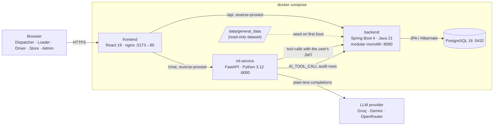

In local development the frontend runs via `npm run dev` instead and Vite proxies `/api` and `/chat` directly — same shape, no nginx hop. See [`frontend/README.md`](frontend/README.md).

The standalone architecture diagram, data model and AI tool disclosure the booklet asks for in a `docs/` folder are in [`docs/`](docs/).

**Why a modular monolith.** Planning, delivery and receipt share transactions and reference data. One deployable keeps those transactions simple. Each backend package owns one slice of the workflow, and the AI service stays separate because its runtime differs.

**Backend packages** (`backend/src/main/java/com/waypoint/backend/`):

| Package | Responsibility |
|---|---|
| `auth`, `security` | Login, token refresh and logout. JWT claims: `userId`, `role`, `permissions`, `depotId`, `outletId`. Method-level role checks. |
| `orders` | Order lifecycle, edits before confirmation, dispatcher deferrals, deferral history. |
| `planning` | Allocation engine, constraint checks, plans (draft, approve, replan), fleet availability. |
| `trips` | Trip lifecycle and dispatch. |
| `loading` | Loader tasks, loading events, shortfall and damage reports. |
| `delivery` | Driver flow: start, arrive, record outcome, complete. Window-lateness detection. |
| `receipts` | Store receipt confirmation and store-side views. |
| `notifications` | Role- and depot-scoped notices. Read state is per user. |
| `sync` | Idempotent replay of offline driver events. |
| `history` | Shared event timeline for orders, trips, loading and plans. |
| `dashboard` | Dispatcher KPIs and alerts. |
| `calendar` | Operating days from `calendar.csv`. |
| `reference` | Depots, outlets, vehicles, district travel times, service allowances. |
| `audit`, `admin` | Audit log, AI tool-call audit, user and fleet management, demo reset, health. |
| `seed` | Loads the dataset CSVs and the four demo accounts on first boot. |

The full endpoint-by-endpoint reference, the security model and the allocation engine's rules in detail are in [`backend/README.md`](backend/README.md) — this section stays at the overview level.

### What happens: one sequence per role

**Store Manager** places an order, confirms it, and later confirms receipt:

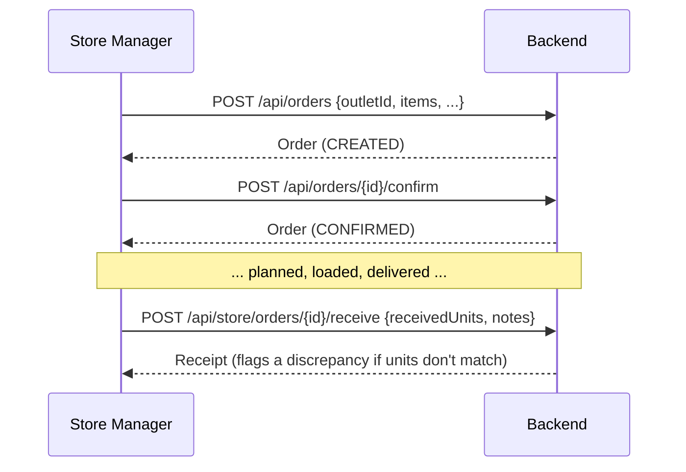

**Dispatcher** generates a plan, approves it, dispatches the trips:

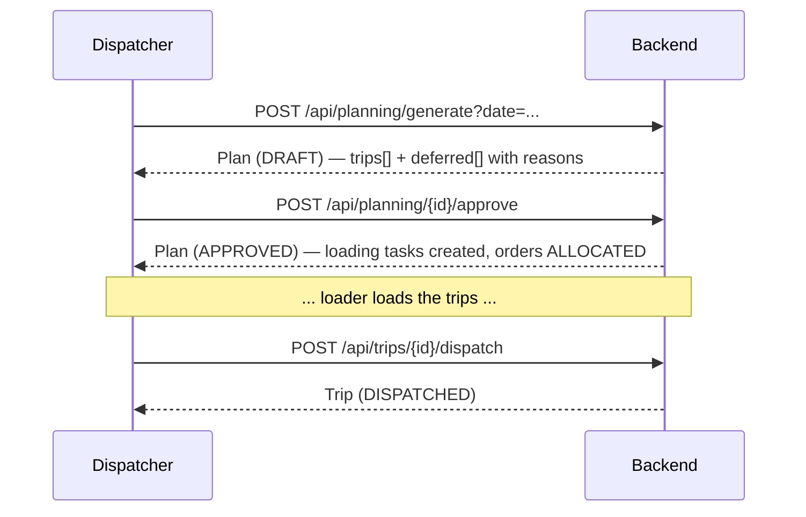

**Loader** starts and completes loading, flags a shortfall if one turns up:

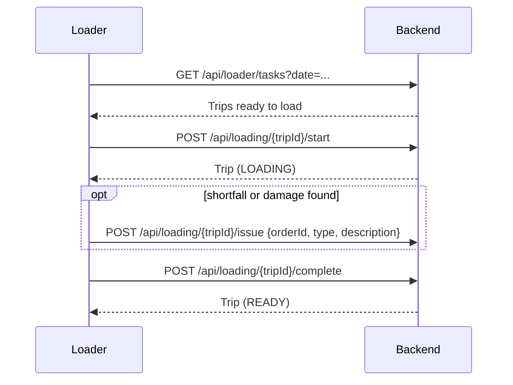

**Driver** runs the route, recording each stop — online or queued offline:

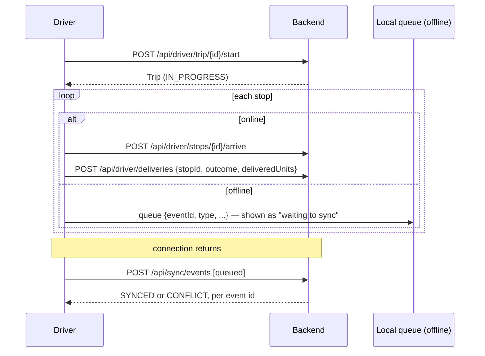

**Admin** checks system health and manages accounts and demo data:

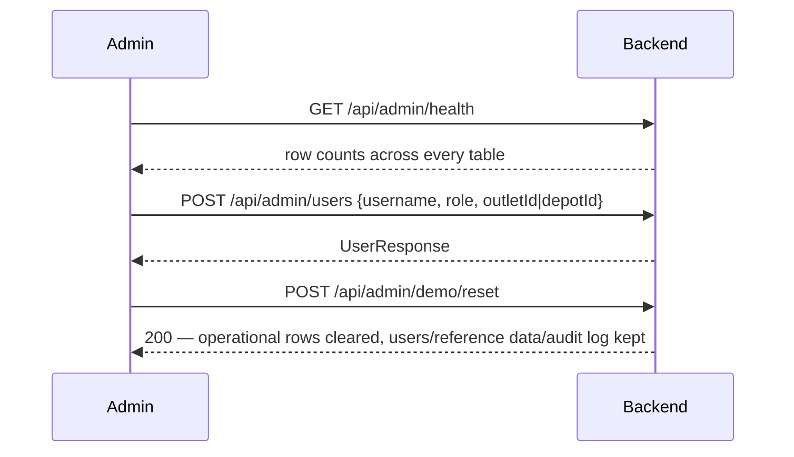

**AI assistant** — a role-scoped read, start to finish:

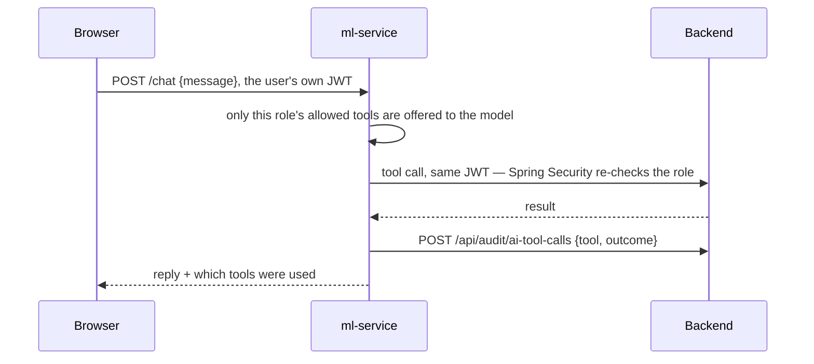

---

## Data model

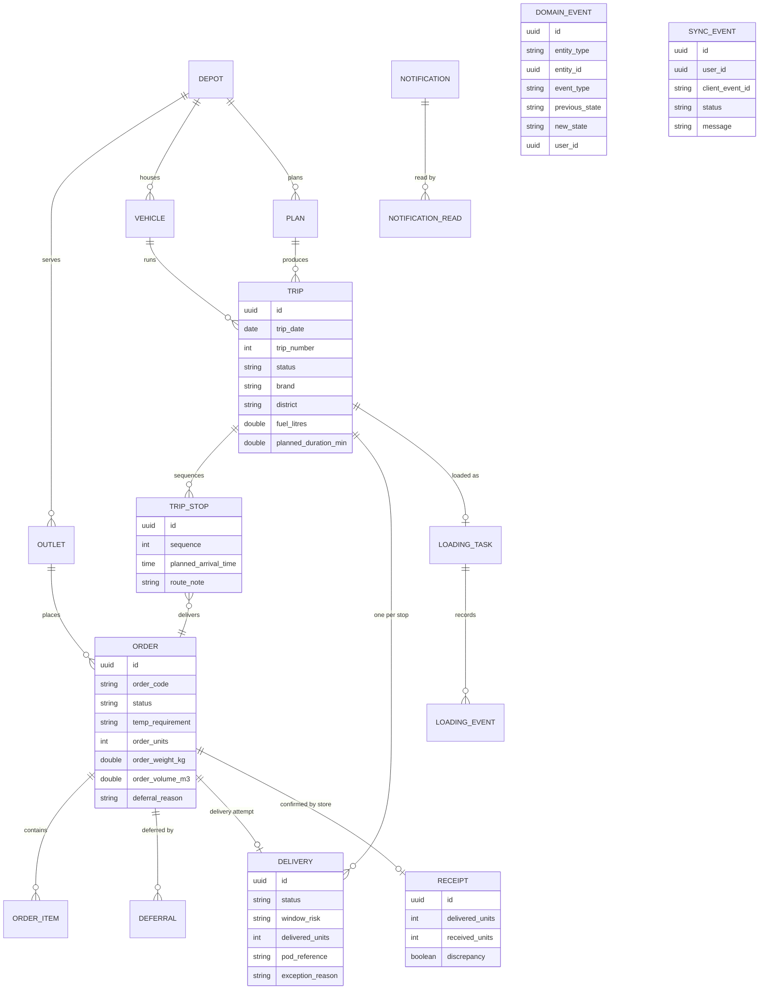

Every table carries `id`, `created_at` and `updated_at`. Reference data is loaded once from the dataset. Operational data is written by the workflow. `domain_events` holds the timeline for orders, trips, loading and plans. `audit_logs` holds security and governance events, including AI tool calls.

---

## Lifecycles

### Order

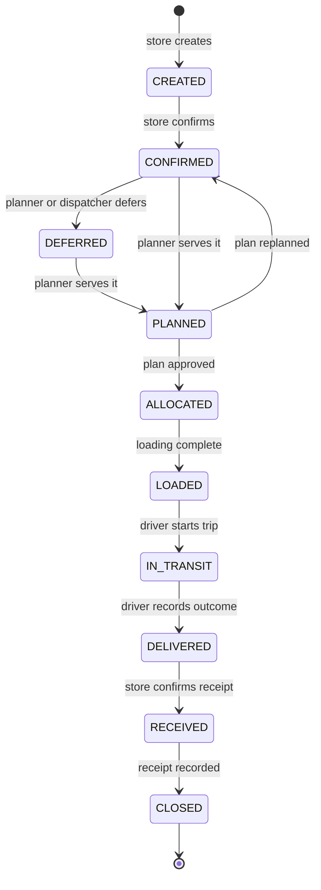

A receipt that differs from the delivered quantity is recorded as a discrepancy. It notifies dispatch and does not block closing.

### Trip

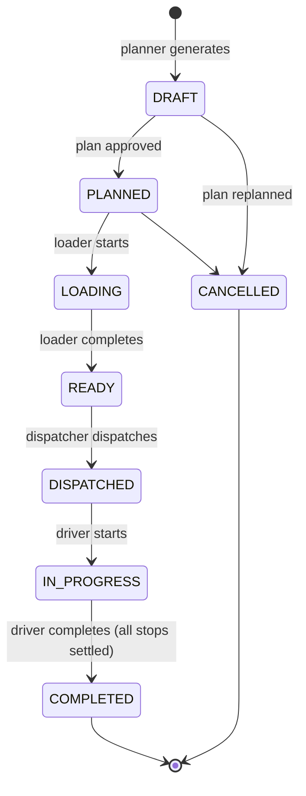

### Delivery (one per stop)

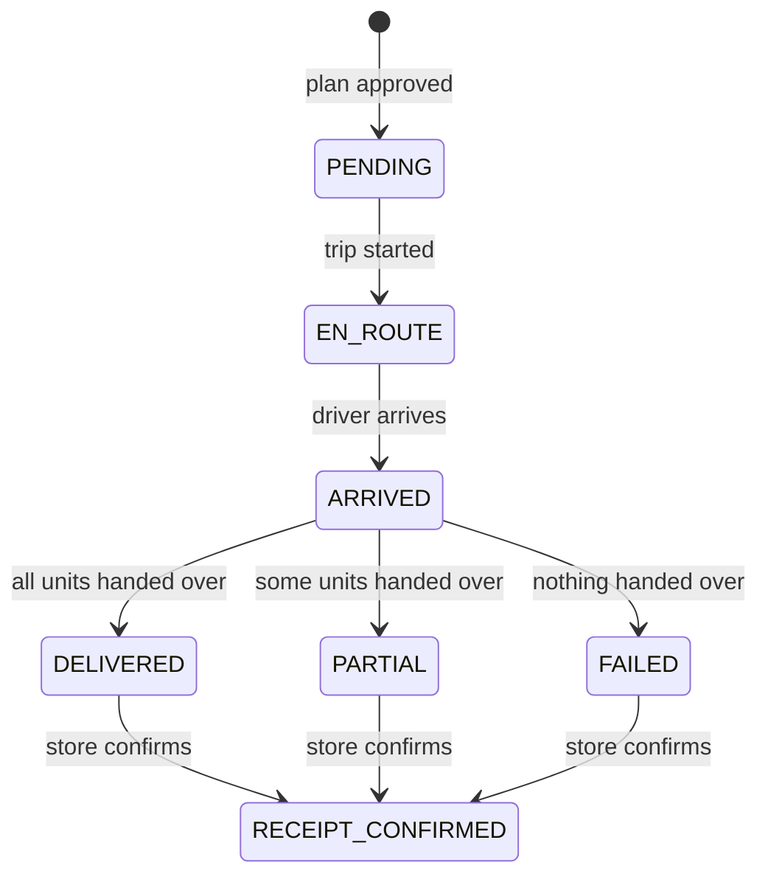

`window_risk` is `LATE` when the driver's arrival falls after the outlet's window closes. Arrival time is the wall clock for trips dated today. For other dates, the planned arrival is used.

### Offline sync event

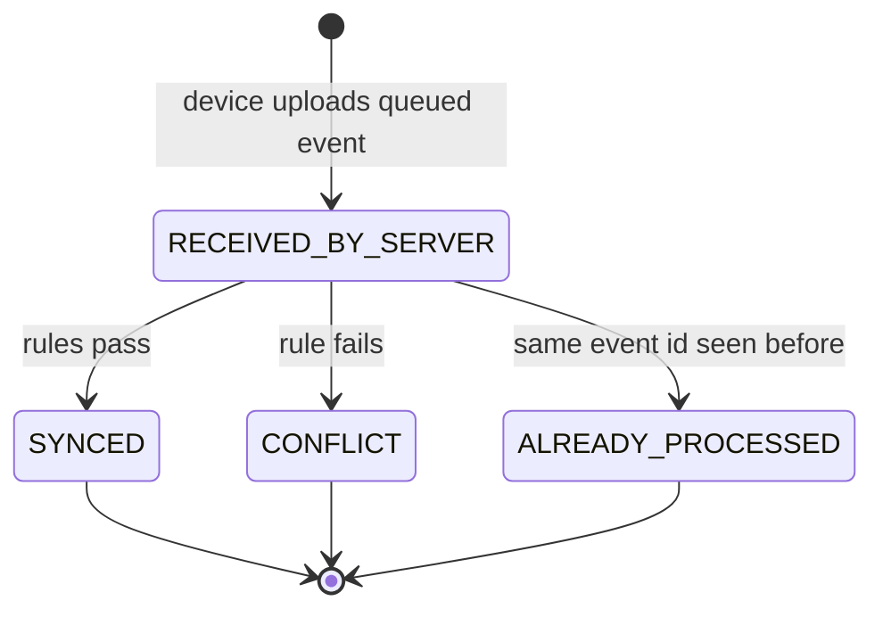

Queued events are replayed through the same services as the online endpoints. A conflict is reported back to the device and to the driver. It never affects other events in the same batch.

---

## Planning and allocation rules

The planner runs once per depot and day. It creates a **draft** plan that the dispatcher reviews. It becomes live only when the dispatcher **approves** it. A draft can be **replanned**, which supersedes it and produces a new one.

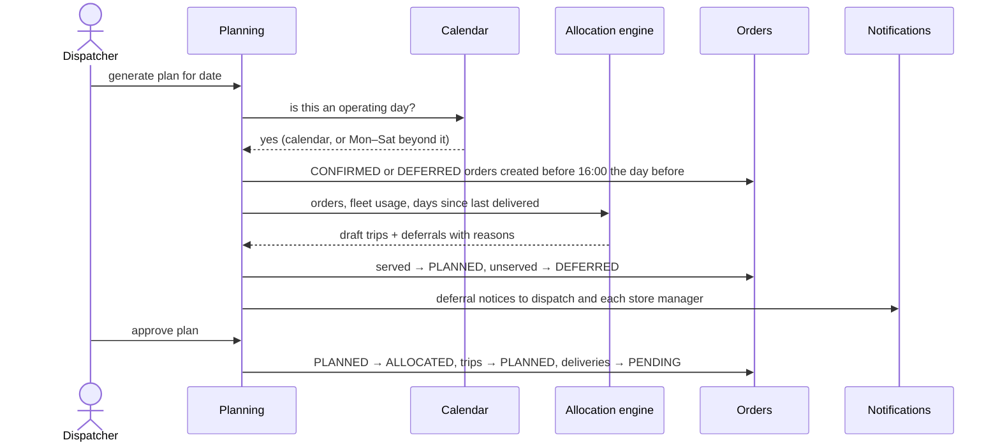

**Hard constraints** (a candidate trip is rejected if any fails):

| Rule | Source |
|---|---|
| Orders on one trip share brand and district | Booklet, Task 2B rule 1 |
| Chilled orders need a reefer vehicle; reefers may carry ambient | Booklet, rule 2 |
| Van-only outlets need a van | Booklet, rule 3 |
| A vehicle serves only its own depot | Booklet, rule 4 |
| Each order goes on exactly one trip | Booklet, rule 5 |
| Weight and volume caps per trip | Booklet, rule 6 |
| At most two trips per vehicle per day | Booklet, rule 7 |
| Fresh budget 270 min; Style and Tech combined 480 min | Booklet, budgets |
| Trip time = outbound + inter-stop × (stops − 1) + handling | Booklet, trip-time steps 1–3 |
| Delivery window: early arrivals wait; arrivals after the close are infeasible | Booklet, outlets |
| Fresh stops finish by 08:00 | Booklet, outlets |
| Mall outlets are limited to the mall access window | Booklet, outlets |
| Weekly fuel quota per vehicle (Monday to Sunday), using one-way route distance | Booklet, fleet; dataset route legs |
| Operating days from `calendar.csv`; Monday–Saturday beyond its coverage | Booklet, demand and operating days |
| Orders created before 16:00 on the previous day | Booklet, cutoff |

**Priority** (soft; ordering only): orders previously deferred first, then the longest time since the outlet was last delivered, then the earliest window close.

**Smart en-route pass.** After packing, each unserved order is tried against existing routes in the same brand and district. It is inserted only if every stop still passes every hard constraint. The detour is recorded on the stop as a route note.

**Deferrals.** Every unserved order gets a list of specific reasons, for example `Weekly fuel quota exhausted` or `Delivery window cannot be met on this route`. The reasons are stored on the order and sent to the store manager.

---

## Setup

### Prerequisites

- Docker Desktop (Compose v2)
- For running the tests outside Docker: JDK 21, Maven 3.9, Python 3.12

### 1. Configure

```bash
cp .env.example .env
```

Edit `.env` if you want. Set `JWT_SECRET` to a random string of at least 32 characters before deploying. Add an LLM key (`GROQ_API_KEY`, `GEMINI_API_KEY` or `OPENROUTER_API_KEY`) if you want the AI assistant to answer. The rest of the system works without one. Each provider's model id is also configurable (`GROQ_MODEL`, `GEMINI_MODEL`, `OPENROUTER_MODEL`) — providers retire model ids over time, so if the assistant starts failing with a "model not found" error, check that provider's current model list and update the matching variable.

### 2. Start the stack

```bash
docker compose up --build
```

This starts PostgreSQL, the backend and the AI service. On first boot the backend loads the dataset and creates the demo accounts. The first build can take several minutes; later starts are quicker.

### 3. Check it is up

```bash
curl -i http://localhost:8080/api/outlets     # 401 or 403 without a token: the backend is up
curl http://localhost:8000/health               # {"status":"ok","provider":"groq"}
```

### 4. Run the frontend

The frontend is not in `docker-compose.yml`. It runs with the Vite dev server against the stack above:

```bash
cd frontend
npm install
npm run dev                                     # http://localhost:5173
```

The dev server proxies `/api` to `http://localhost:8080` and `/chat` to `http://localhost:8000`. Override with `VITE_BACKEND_URL` and `VITE_AI_URL`. The [frontend README](frontend/README.md) covers the screens, the offline design and the design tokens.

### Stop and reset

```bash
docker compose down           # stop, keep data
docker compose down -v        # stop and delete the database volume (fresh seed on next start)
```

### Without Docker

```bash
# Database
docker run -d --name waypoint-db -p 5432:5432 -e POSTGRES_USER=waypoint \
  -e POSTGRES_PASSWORD=waypoint -e POSTGRES_DB=waypoint postgres:16

# Backend (run from hackathon/backend so the dataset path resolves)
cd backend && ./mvnw spring-boot:run

# AI service
cd ml-service && python -m venv venv && source venv/bin/activate
pip install -r requirements.txt && uvicorn app.main:app --port 8000
```

---

## Seeded accounts

All accounts use the password `password123`.

| Username | Role | Scope | Use it for |
|---|---|---|---|
| `dispatcher1` | DISPATCHER | Peliyagoda depot | Planning, approval, dispatch, deferrals, dashboard |
| `loader1` | LOADER | Peliyagoda depot | Loader tasks, loading, shortfalls |
| `driver1` | DRIVER | Peliyagoda depot | Trip start, stops, deliveries, offline sync |
| `store1` | STORE_MANAGER | Outlet OUT001 (Fresh, Colombo) | Orders, confirmation, receipt |
| `admin1` | ADMIN | All | Users, fleet, audit log, demo reset, health |

The seed also loads 2 depots, 120 outlets, 60 vehicles, 12 district travel rows, 9 service allowances and 910 calendar days from `data/general_data/`.

The system starts with **no orders and no plans**. The walkthrough creates them.

---

## Judge walkthrough

This walkthrough covers the full workflow across all four roles, from order to receipt. It uses the REST API so each call is visible. Run it against a fresh install (`docker compose down -v && docker compose up --build`).

To do the same steps in the UI, start the frontend (see [Setup, step 4](#4-run-the-frontend)) and sign in at `/login` with each account in turn: store1 creates and confirms the order, dispatcher1 generates and approves the plan and dispatches the trips, loader1 starts and completes loading, driver1 starts the trip and records arrivals and deliveries, and store1 confirms receipt. Use the Admin screens with admin1 to check the audit log and health.

Each command assumes a Bash-compatible shell with GNU `date` (Git Bash or Linux). On macOS, replace `date -d "+2 days"` with `date -v+2d`. Requires `curl` and `python`. If the planning day falls on a Sunday, use `+3 days`.

**Set up shared variables** (choose a day that is an operating day and at least two days out, so the 4 PM cutoff does not affect it):

```bash
API=http://localhost:8080/api
DAY=$(date -d "+2 days" +%F)
login() { curl -s -X POST $API/auth/login -H "Content-Type: application/json" \
  -d "{\"username\":\"$1\",\"password\":\"password123\"}" | python -c "import sys,json;print(json.load(sys.stdin)['token'])"; }
STORE=$(login store1); DISP=$(login dispatcher1); LOAD=$(login loader1); DRV=$(login driver1)
```

### Step 1 — Store manager places and confirms orders

```bash
OUTLET=$(curl -s $API/outlets -H "Authorization: Bearer $STORE" | python -c "import sys,json;print(json.load(sys.stdin)[0]['id'])")
for i in 1 2 3; do
  ORDER=$(curl -s -X POST $API/orders -H "Authorization: Bearer $STORE" -H "Content-Type: application/json" -d "{
    \"outletId\":\"$OUTLET\",\"tempRequirement\":\"AMBIENT\",\"orderUnits\":6,
    \"orderWeightKg\":40,\"orderVolumeM3\":1.2,\"items\":[{\"itemName\":\"Demo item $i\",\"quantity\":6}]}")
  ID=$(echo "$ORDER" | python -c "import sys,json;print(json.load(sys.stdin)['id'])")
  curl -s -X POST $API/orders/$ID/confirm -H "Authorization: Bearer $STORE" > /dev/null
done
```

Expected: three orders in status `CONFIRMED`. Order `CREATED` → `CONFIRMED` is the store's act of confirmation before the cutoff.

### Step 2 — Dispatcher generates and approves the plan

```bash
PLAN=$(curl -s -X POST "$API/planning/generate?date=$DAY" -H "Authorization: Bearer $DISP")
PLAN_ID=$(echo "$PLAN" | python -c "import sys,json;print(json.load(sys.stdin)['id'])")
echo "$PLAN" | python -m json.tool | head -60          # trips, stops, planned arrivals, deferred reasons
curl -s -X POST $API/planning/$PLAN_ID/approve -H "Authorization: Bearer $DISP" > /dev/null
curl -s "$API/vehicles/available?date=$DAY" -H "Authorization: Bearer $DISP"   # remaining fleet capacity
```

Expected: a `DRAFT` plan with trips, then `APPROVED`. Each stop shows a planned arrival within its window. Any unserved order appears under `deferred` with specific reasons. Replanning instead of approving is `POST /api/planning/{id}/replan`.

### Step 3 — Loader loads the trips

```bash
TRIP=$(curl -s "$API/loader/tasks?date=$DAY" -H "Authorization: Bearer $LOAD" | python -c "import sys,json;print(json.load(sys.stdin)[0]['id'])")
curl -s -X POST $API/loading/$TRIP/start    -H "Authorization: Bearer $LOAD" > /dev/null
curl -s -X POST $API/loading/$TRIP/issue    -H "Authorization: Bearer $LOAD" -H "Content-Type: application/json" \
  -d '{"type":"SHORTFALL","description":"One carton short from the warehouse"}' > /dev/null
curl -s -X POST $API/loading/$TRIP/complete -H "Authorization: Bearer $LOAD" > /dev/null
curl -s -X POST $API/trips/$TRIP/dispatch   -H "Authorization: Bearer $DISP" > /dev/null
```

Expected: orders move `ALLOCATED` → `LOADED`. The dispatcher receives a `LOADING_SHORTFALL` notice. The loading event history is at `GET /api/loading/{tripId}/events`.

### Step 4 — Driver runs the route and records each stop

```bash
curl -s -X POST $API/driver/trip/$TRIP/start -H "Authorization: Bearer $DRV" > /dev/null
STOPS=$(curl -s "$API/driver/stops?date=$DAY" -H "Authorization: Bearer $DRV")
echo "$STOPS" | python -m json.tool | head -40          # sequence, planned arrival, window close, status
for STOP in $(echo "$STOPS" | python -c "import sys,json;[print(s['stopId']) for s in json.load(sys.stdin)]"); do
  curl -s -X POST $API/driver/stops/$STOP/arrive -H "Authorization: Bearer $DRV" > /dev/null
  curl -s -X POST $API/driver/deliveries -H "Authorization: Bearer $DRV" -H "Content-Type: application/json" \
    -d "{\"stopId\":\"$STOP\",\"outcome\":\"DELIVERED\",\"deliveredUnits\":6,\"podReference\":\"signed-$STOP\"}" > /dev/null
done
curl -s -X POST $API/trips/$TRIP/complete -H "Authorization: Bearer $DRV" > /dev/null
```

Expected: each stop moves `EN_ROUTE` → `ARRIVED` → `DELIVERED`. Trip completion is refused until every stop is settled.

**Optional: offline replay.** Any stop can be recorded through the sync queue instead, with an event ID and a client timestamp:

```bash
curl -s -X POST $API/sync/events -H "Authorization: Bearer $DRV" -H "Content-Type: application/json" \
  -d "{\"events\":[{\"eventId\":\"evt-1\",\"type\":\"DRIVER_ARRIVED\",\"stopId\":\"$STOP\",\"clientTimestamp\":\"$(date -u +%FT%TZ)\"}]}"
```

Sending the same `eventId` again returns `Already processed`. An event that cannot be applied returns `CONFLICT`, with the reason.

### Step 5 — Store manager confirms receipt

```bash
curl -s "$API/store/orders" -H "Authorization: Bearer $STORE" | python -m json.tool | head -40
ORDER_ID=$(curl -s "$API/store/orders" -H "Authorization: Bearer $STORE" | python -c "import sys,json;print(json.load(sys.stdin)[0]['id'])")
curl -s -X POST $API/store/orders/$ORDER_ID/receive -H "Authorization: Bearer $STORE" -H "Content-Type: application/json" \
  -d '{"receivedUnits":6,"notes":"All cartons received"}'
curl -s $API/store/orders/summary -H "Authorization: Bearer $STORE"
```

Expected: the order moves `DELIVERED` → `RECEIVED` → `CLOSED`. A quantity that differs from the delivered count is recorded as a discrepancy and raised to dispatch.

### Step 6 — Dispatcher reviews the outcome

```bash
curl -s "$API/dashboard/kpis?date=$DAY" -H "Authorization: Bearer $DISP"
curl -s "$API/dashboard/alerts" -H "Authorization: Bearer $DISP"
curl -s "$API/history?entityType=Order&entityId=$ORDER_ID" -H "Authorization: Bearer $DISP"
```

Expected: KPIs for served and deferred orders and active trips. Alerts list late arrivals, shortfalls and discrepancies. The order's history shows every transition with the user who made it.

### Step 7 — A deferral, end to end

```bash
# Create and confirm an order that will not fit this run, then defer it manually
ORDER=$(curl -s -X POST $API/orders -H "Authorization: Bearer $STORE" -H "Content-Type: application/json" -d "{
  \"outletId\":\"$OUTLET\",\"tempRequirement\":\"CHILLED\",\"orderUnits\":4,
  \"orderWeightKg\":20,\"orderVolumeM3\":0.5,\"items\":[{\"itemName\":\"Chilled demo\",\"quantity\":4}]}")
ID=$(echo "$ORDER" | python -c "import sys,json;print(json.load(sys.stdin)['id'])")
curl -s -X POST $API/orders/$ID/confirm -H "Authorization: Bearer $STORE" > /dev/null
curl -s -X POST $API/orders/$ID/defer -H "Authorization: Bearer $DISP" -H "Content-Type: application/json" \
  -d '{"reason":"Held until the next run by dispatcher decision"}'
curl -s "$API/notifications" -H "Authorization: Bearer $STORE"          # the store manager is told
```

Expected: the order is `DEFERRED`, the store manager has a notice with the reason, and the next plan considers the order again with priority.

### Step 8 — Admin checks the system

```bash
ADMIN=$(login admin1)
curl -s $API/admin/health -H "Authorization: Bearer $ADMIN"
curl -s "$API/admin/audit-logs?limit=20" -H "Authorization: Bearer $ADMIN"
```

Expected: database status `UP`, row counts, and the audit trail for every action in this walkthrough.

**AI assistant (optional, needs an LLM key in `.env`).** Each tool call is audited under the user's own token.

```bash
curl -s -X POST http://localhost:8000/chat -H "Authorization: Bearer $DISP" -H "Content-Type: application/json" \
  -d '{"message":"Are there any deferred orders right now?"}'
```

The role comes from the token. A store manager asking the same question cannot reach dispatch tools.

---

## API reference

Every endpoint except login and refresh requires `Authorization: Bearer <token>`. Errors use one shape: `{timestamp, status, error, message, path}`.

| Area | Method and path | Role |
|---|---|---|
| Auth | `POST /api/auth/login` · `POST /api/auth/refresh` · `POST /api/auth/logout` | any |
| Outlets | `GET /api/outlets` · `GET /api/outlets/{id}` | any |
| Vehicles | `GET /api/vehicles` · `GET /api/vehicles/{id}` · `GET /api/vehicles/available?date=` | any · dispatcher |
| Orders | `GET /api/orders` · `GET /api/orders/{id}` | scoped by role |
| | `POST /api/orders` · `PATCH /api/orders/{id}` · `POST /api/orders/{id}/confirm` | store |
| | `POST /api/orders/{id}/defer` | dispatcher |
| Planning | `POST /api/planning/generate?date=` · `GET /api/planning/current?date=` | dispatcher |
| | `POST /api/planning/{id}/approve` · `POST /api/planning/{id}/replan` | dispatcher |
| Trips | `GET /api/trips?date=` · `GET /api/trips/{id}` · `POST /api/trips/{id}/dispatch` | depot scoped · dispatcher |
| | `POST /api/trips/{id}/complete` | driver |
| Loading | `GET /api/loader/tasks?date=` · `POST /api/loading/{id}/start` · `/complete` · `/issue` | loader |
| | `GET /api/loading/{id}/events` | loader · dispatcher |
| Driver | `GET /api/driver/trip?date=` · `GET /api/driver/summary?date=` · `GET /api/driver/stops?date=` | driver |
| | `POST /api/driver/trip/{id}/start` · `POST /api/driver/stops/{id}/arrive` · `POST /api/driver/deliveries` | driver |
| Store | `GET /api/store/orders` · `GET /api/store/orders/{id}` · `GET /api/store/orders/summary` | store |
| | `POST /api/store/orders/{id}/receive` | store |
| Sync | `POST /api/sync/events` · `GET /api/sync/status` | driver |
| Dashboard | `GET /api/dashboard/kpis?date=` · `GET /api/dashboard/alerts` | dispatcher |
| History | `GET /api/history?entityType=&entityId=` | dispatcher · admin |
| Notifications | `GET /api/notifications` · `POST /api/notifications/{id}/read` | any |
| Audit | `POST /api/audit/ai-tool-calls` | any (used by the AI service) |
| Admin | `GET/POST /api/admin/users` · `PATCH /api/admin/users/{id}` | admin |
| | `POST /api/admin/vehicles` · `PUT /api/admin/vehicles/{id}` · `DELETE /api/admin/vehicles/{id}` | admin |
| | `GET /api/admin/audit-logs` · `POST /api/admin/demo/reset` · `POST /api/admin/demo/seed` · `GET /api/admin/health` | admin |

AI service: `GET /health` · `POST /chat` (`{"message": "...", "context": {...}}`, bearer token required).

---

## Departures from the Designathon

The Designathon design is the specification. These are the departures we made, and why.

| Designathon | Built | Reason |
|---|---|---|
| Live fleet-wide operations map | Not built. Routes are stop lists with planned arrivals and windows | The brief does not require a fleet map, and the dataset has no stored coordinates for one |
| Driver turn-by-turn navigation | An inline directions panel per stop, embedded in the page (no new tab). The destination is geocoded from the outlet and district by Google Maps itself; the origin is left unset so Maps uses the driver's live device location as the start point | No coordinates are stored in the dataset, and no map API key is used — this is Maps' own key-less embed, with an "Open in Google Maps" fallback link |
| "Critical" stops, orders and KPIs | Not built | The brief does not define "critical". We did not invent a threshold |
| Driver "Order Clock" and ETA countdown | A live countdown to each stop's window close, ticking every second, colour-coded by urgency | Built on data the system already has (planned window close); no live GPS needed |
| Floating AI assistant with multi-step actions | Read-only tools, role-scoped, audited. No actions | Mutating actions need a confirmation step we did not build in time |
| Smart route adjustment callout | Route note on inserted stops, with the detour in minutes | Implemented as a feasibility-checked insertion, not a route optimiser |
| Separate Delivery and Receipt tables | Delivery is one row per stop; receipt is one row per order | Keeps the lifecycle in one place; the state machines remain separate |
| Trip states DISPATCHED and IN_PROGRESS as separate screens | Both kept. Dispatch is a dispatcher action; driver start is separate | Matches the trip lifecycle in the build plan |
| Driver sync screen as a simulator | Real event queue with idempotency and conflict reporting | The backend side of offline operation is complete |
| Store "ETA" | Expected arrival per order from the planned stop time | Same source as the planner; no separate estimate |
| Designathon screens for all four roles | Built on the same routes, tokens and icons, with live data in place of mock data | Fidelity to the Designathon is part of the brief |
| Designathon has no admin area | Admin overview, users, fleet, audit log and access reference | Needed to manage accounts, vehicles and demo data without the API |
| Designathon has no deferral or order history view | Deferred orders screen with reasons, and an order history drawer | Deferral records are a stated problem in the brief |
| Landing page photography from an external image host | Generated route illustration, with a local photo used when one is supplied | Keeps the landing page working without external images |
| One driver account, one implicit trip | A vehicle picker on the driver dashboard when more than one trip is dispatched at the depot at once | Trips carry no driver assignment in the data model (the planning engine allocates against the fleet, not named drivers), so this was needed as soon as more than one trip could be active together |
| Plan generation always includes every confirmed order | Dispatcher can tick which confirmed orders a draft should consider, defaulting to all of them | Gives the dispatcher control over what goes into a given planning run, not just visibility into the result |

---

## Testing

Three end-to-end suites exercise the running system over HTTP. Each creates its own data and resets the database at the end.

| Suite | Scope | Result |
|---|---|---|
| Main workflow | Auth, role boundaries, orders, planning (replan, approve, cutoff, calendar), loading, driver, sync, receipts, notifications, admin | 83 / 83 |
| Feature checks | History, loading events, dashboards, driver and store summaries, AI audit, role boundaries on new endpoints | 37 / 37 |
| AI service | Role scoping, tool budget, parsing, audit writes, HTTP path. Uses a scripted provider, so no LLM is called | 21 / 21 |

Unit tests are not included. The backend's `BackendApplicationTests` is the Spring Boot default and is not yet extended.

The frontend is checked by `npm run build` in `frontend/`, which runs the TypeScript compiler and the production bundler. It has no automated UI tests; the walkthrough above is the functional test.
