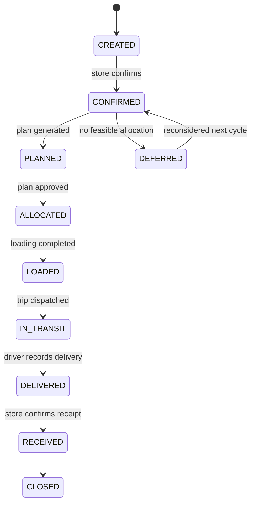
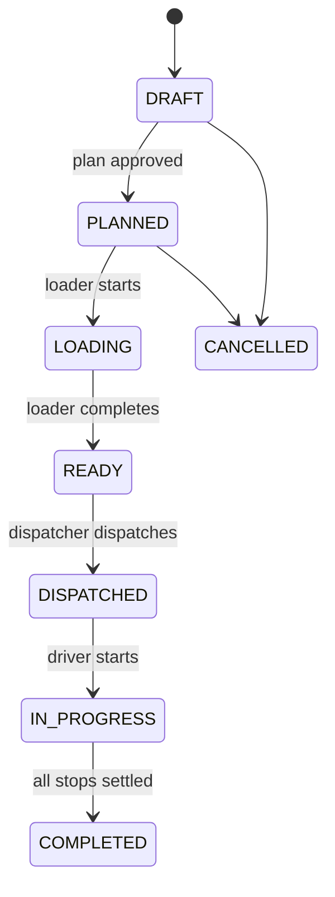
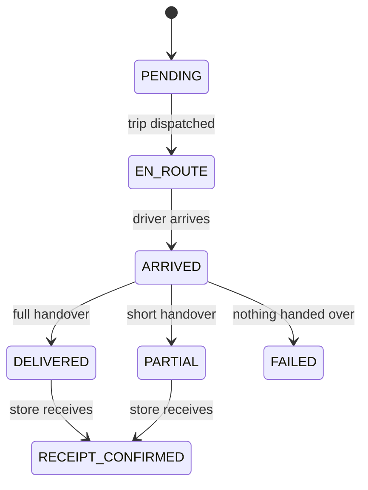
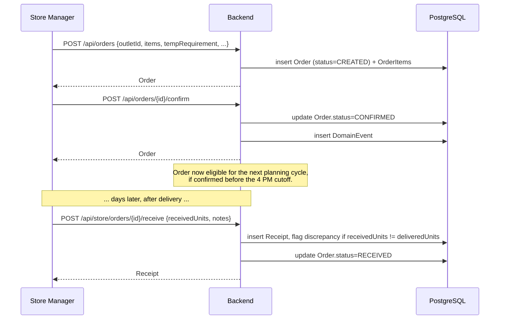
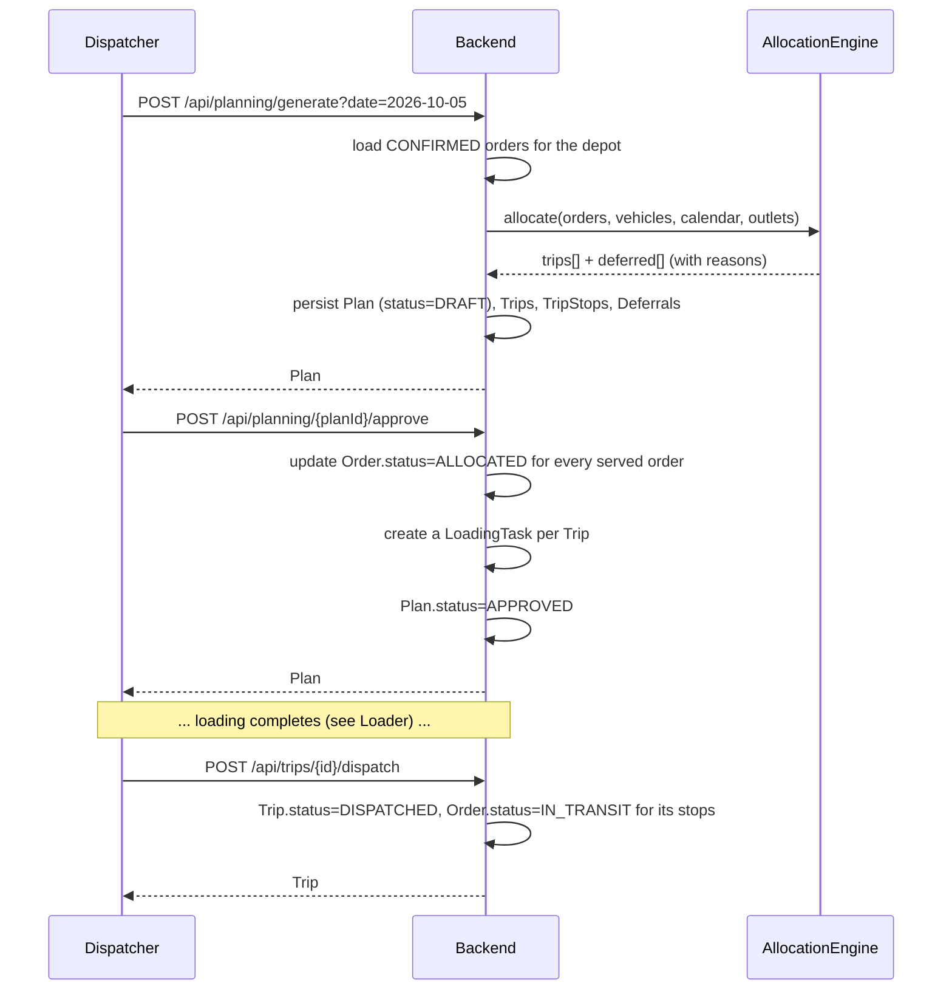
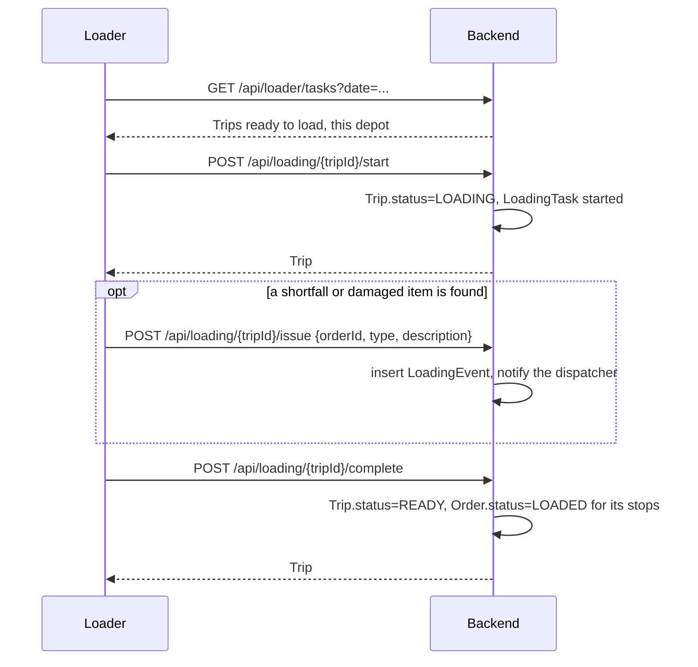
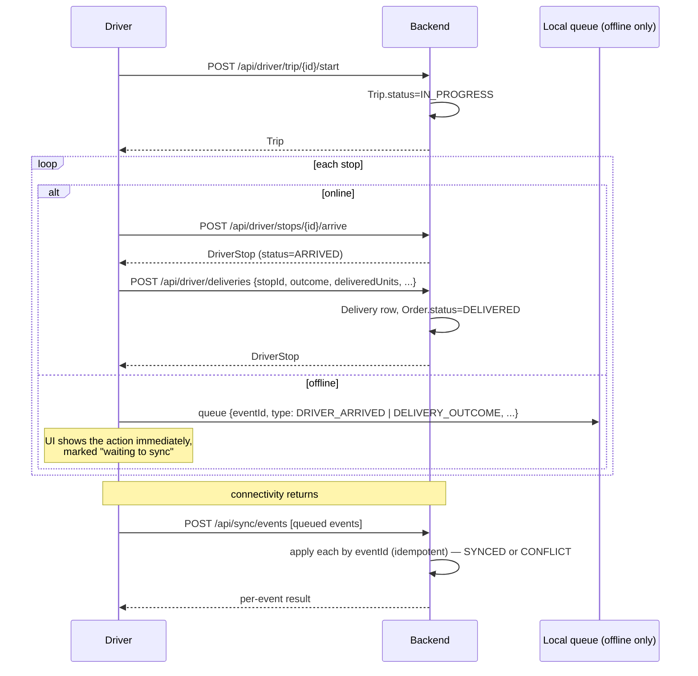
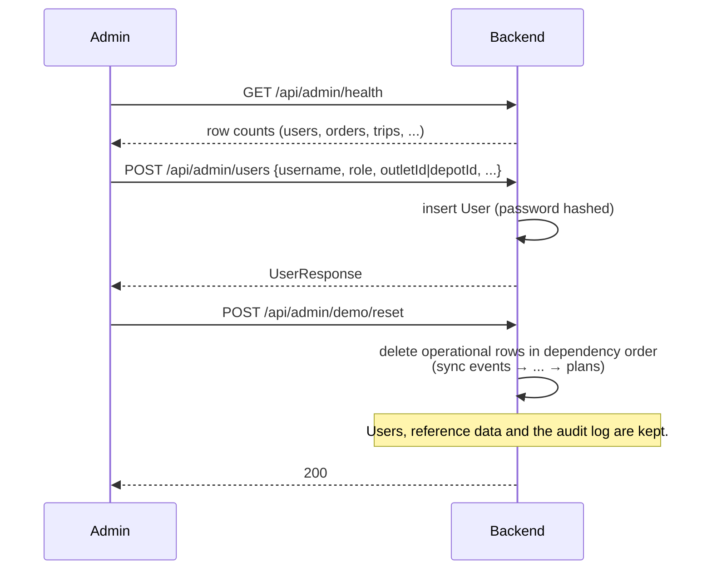
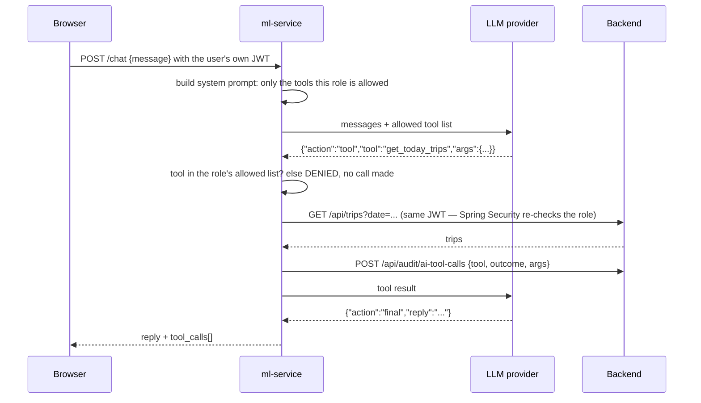

# Waypoint backend

Spring Boot 4.1.1 / Java 21 / Hibernate 7 / PostgreSQL 16. A modular monolith — one deployable, one database, packages split by business area instead of by technical layer. This document explains how it is put together and walks through what actually happens, step by step, for each role.

For the system as a whole (problem, roles, setup, seeded accounts, judge walkthrough) see the [project README](../README.md). For the AI service see [`../ml-service`](../ml-service). For the frontend see [`../frontend/README.md`](../frontend/README.md).

---

## Contents

1. [Why a modular monolith](#why-a-modular-monolith)
2. [Package map](#package-map)
3. [Domain model](#domain-model)
4. [Security](#security)
5. [The planning and allocation engine](#the-planning-and-allocation-engine)
6. [What happens: one sequence per role](#what-happens-one-sequence-per-role)
7. [Endpoint reference](#endpoint-reference)
8. [Audit logging](#audit-logging)
9. [Error handling](#error-handling)
10. [Running it on its own](#running-it-on-its-own)
11. [Tests](#tests)

---

## Why a modular monolith

Four roles, one depot network, one source of truth. Splitting this into services per role would mean distributed transactions for something as simple as "approving a plan creates loading tasks and updates order status" — three writes that must succeed or fail together. A modular monolith keeps that one `@Transactional` method, one database, and one deploy, while still keeping the code itself organized by business area (`orders`, `planning`, `trips`, …) rather than by technical layer (`controllers`, `services`, `repositories`). Each package owns its controller, service, repository and entities; packages talk to each other through service methods, not through HTTP.

---

## Package map

| Package | Owns |
|---|---|
| `security` | `User`, `Role`, JWT issuing/validation, the Spring Security filter chain, `CustomUserDetails` |
| `auth` | Login, refresh, logout — issues the JWT |
| `orders` | `Order`, `OrderItem`, `Deferral` — the order lifecycle from creation to deferral |
| `planning` | `Plan`, the allocation engine, constraint validation, trip time calculation |
| `trips` | `Trip`, `TripStop` — dispatch, in-progress, completion |
| `loading` | `LoadingTask`, `LoadingEvent` — the loader's start/complete/issue flow |
| `delivery` | `Delivery` — the driver's trip, stops, arrival and delivery outcome |
| `receipts` | `Receipt` — the store's confirmation of what arrived |
| `notifications` | `Notification`, `NotificationRead` — in-app notices, direct and role+depot broadcasts |
| `sync` | `SyncEvent` — the driver's offline event queue and idempotent replay |
| `history` | `DomainEvent` — one row per state transition, across every lifecycle |
| `dashboard` | Dispatcher KPIs and alerts, aggregated from the other packages |
| `calendar` | `CalendarDay` — which dates are operating days |
| `reference` | `Outlet`, `Vehicle`, `Depot`, `DistrictTravel`, `ServiceAllowance` — the static dataset |
| `audit` | `AuditLog` — every write, sign-in and AI tool call |
| `admin` | User management, vehicle CRUD, demo reset/seed, system health |
| `seed` | `DataSeeder` — loads `reference/` and `calendar` from the competition dataset on first boot |
| `common` | `ApiException`, `GlobalExceptionHandler`, `BaseEntity`, the fixed clock bean |

---

## Domain model

### Entities

`User, Order, OrderItem, Deferral, Vehicle, Outlet, Depot, DistrictTravel, ServiceAllowance, CalendarDay, Plan, Trip, TripStop, LoadingTask, LoadingEvent, Delivery, Receipt, Notification, NotificationRead, SyncEvent, DomainEvent, AuditLog`

### Three state machines, kept separate

A trip's status and its stops' delivery statuses are not the same thing — a trip can be `IN_PROGRESS` while one stop is `DELIVERED` and the next is still `EN_ROUTE`. Collapsing these into one field would lose exactly that distinction, so each entity owns its own machine:







Every transition writes one `DomainEvent` row (`entityType, entityId, eventType, previousState, newState, userId, timestamp, metadata`). `GET /api/history` reads this log — it is also what the order detail drawer in the frontend shows as a timeline.

---

## Security

JWT carries `{userId, role, permissions}`. Three layers, each one real, not decorative:

1. **Frontend** hides screens and actions a role cannot use (`RequireRole`, `navConfig.ts`).
2. **Spring Security + `@PreAuthorize`** rejects the request before it reaches a controller method if the role doesn't match (see the [endpoint reference](#endpoint-reference) — every mutating endpoint is annotated).
3. **Service-level, resource-level filtering.** A role check alone is not enough: a driver with role `DRIVER` must only see *their own* trip, not every driver's. `DeliveryService`, `LoadingService` and `ReceiptService` all filter by the caller's `depotId`/`outletId`/assigned-trip at the query level — a driver's `GET /api/driver/stops` is built from "stops on a trip assigned to this user", never "all stops, filtered client-side".

The ml-service never holds a backend credential. Every tool call it makes forwards the signed-in user's own JWT, so the same three layers apply to the AI assistant's reads as to a browser request.

---

## The planning and allocation engine

Pipeline: `Confirmed orders → candidate generation → hard constraint check → prioritisation → route construction → feasibility check → allocate or defer`.

**Hard constraints (never violated):**
- Weight cap **and** volume cap — two dimensions, checked independently.
- Chilled/frozen orders need a reefer vehicle. Reefers may carry ambient too.
- A vehicle only serves its own depot's outlets.
- Delivery window — the engine waits for an early arrival rather than rejecting it, but never plans an arrival after the window closes.
- Mall outlets — only inside the mall's access window.
- Van-only outlets — never allocated a truck.
- Weekly fuel quota, consumed by the route's distance.
- At most two trips per vehicle per day.
- Fresh runs inside a 270-minute budget (targeting the 8 AM store opening); Style/Tech share a 480-minute budget. Checked independently, but the two-trip cap still applies across both.

**Trip time** (`TripCalculator`), the same formula as the Datathon's reference spec:

```
trip_minutes = depot_to_district_freeflow_min                 (once, outbound)
             + inter_stop_freeflow_min × (stops − 1)            (inter-stop travel)
             + Σ service_allowance_min(brand, dock_type)        (per-stop handling)
```

**Prioritisation (soft, tie-breaking only):** orders deferred in a previous cycle, and outlets with the most days since their last delivery, are placed first. This is what keeps a deferral from becoming permanent — `Deferral` rows feed directly into the next cycle's ordering.

**Smart en-route insertion:** if an outlet lies on the path between two stops a trip has already committed to, and adding it doesn't break any hard constraint, the engine inserts it and records the detour in minutes as a route note on that stop — visible on the dispatcher's planning screen and the driver's stop card.

**Deferral:** when no vehicle/trip combination is feasible, the order is marked `DEFERRED` with a structured reason list (e.g. `No compatible refrigerated vehicle`, `Would exceed the Fresh time budget`). The AI assistant can read and explain these reasons; it never invents or alters them.

A generated plan is a `DRAFT`. It becomes the day's live plan only once the dispatcher approves it (`POST /api/planning/{id}/approve`), which is also the moment `LoadingTask` rows are created and orders move to `ALLOCATED`. `POST /api/planning/{id}/replan` discards a draft and regenerates from the currently confirmed orders — useful if more orders were confirmed after the first draft.

---

## What happens: one sequence per role

### Store Manager — place an order, later confirm receipt



### Dispatcher — generate a plan, approve it, dispatch trips



### Loader — load a trip, flag a shortfall



### Driver — run the route, record each stop, work offline

Trips carry no driver assignment — the planning engine allocates against the fleet, not named drivers (see the planning section above). When more than one trip is dispatched at a depot at once, the driver's dashboard asks which vehicle they're on (`GET /api/driver/trips` lists the candidates); every other driver endpoint then takes that trip's id explicitly instead of guessing.



### Admin — reset demo data, manage a user, check system health



### AI assistant — a role-scoped read, start to finish



The LLM never touches the database and never decides access — `allowed_tools_for_role()` in `ml-service/app/tools.py` is the single list, and every tool call still goes through the backend's own `@PreAuthorize` and resource filtering, exactly as if the browser had called it directly.

---

## Endpoint reference

Grouped by package. `Role` is the `@PreAuthorize` constraint; blank means any authenticated user.

| Method & path | Package | Role |
|---|---|---|
| POST `/api/auth/login`, `/refresh`, `/logout` | auth | — |
| GET `/api/orders`, GET `/api/orders/{id}` | orders | — (filtered server-side to the caller) |
| POST `/api/orders` | orders | STORE_MANAGER |
| PATCH `/api/orders/{id}` | orders | STORE_MANAGER |
| POST `/api/orders/{id}/confirm` | orders | STORE_MANAGER |
| POST `/api/orders/{id}/defer` | orders | DISPATCHER |
| POST `/api/planning/generate` (optional body `{orderIds}` to plan a subset), GET `/current`, POST `/{id}/approve`, `/{id}/replan` | planning | DISPATCHER |
| GET `/api/vehicles`, `/api/vehicles/{id}` | reference.vehicle | — |
| GET `/api/vehicles/available` | planning (FleetController) | DISPATCHER, ADMIN |
| GET `/api/outlets`, `/api/outlets/{id}` | reference.outlet | — |
| GET `/api/trips`, `/api/trips/{id}` | trips | — |
| POST `/api/trips/{id}/dispatch` | trips | DISPATCHER |
| POST `/api/trips/{id}/complete` | trips | DRIVER |
| GET `/api/loader/tasks` | loading | LOADER |
| GET `/api/loading/{tripId}/events` | loading | LOADER, DISPATCHER |
| POST `/api/loading/{tripId}/start`, `/complete`, `/issue` | loading | LOADER |
| GET `/api/driver/trips` (every dispatched/in-progress trip at the depot, for the driver's vehicle picker) | delivery | DRIVER |
| GET `/api/driver/trip`, `/summary`, `/stops` (optional `tripId`, required once more than one trip is active) | delivery | DRIVER |
| POST `/api/driver/trip/{id}/start` | delivery | DRIVER |
| POST `/api/driver/stops/{id}/arrive` | delivery | DRIVER |
| POST `/api/driver/deliveries` | delivery | DRIVER |
| POST `/api/sync/events`, GET `/api/sync/status` | sync | DRIVER |
| GET `/api/store/orders`, `/summary`, `/{id}` | receipts | STORE_MANAGER |
| POST `/api/store/orders/{id}/receive` | receipts | STORE_MANAGER |
| GET `/api/dashboard/kpis`, `/alerts` | dashboard | DISPATCHER |
| GET `/api/notifications` | notifications | — (filtered to the caller) |
| POST `/api/notifications/{id}/read` | notifications | — |
| GET `/api/history` | history | DISPATCHER, ADMIN |
| GET `/api/admin/depots` | admin | ADMIN |
| GET/POST/PATCH `/api/admin/users` | admin | ADMIN |
| POST/PUT/DELETE `/api/admin/vehicles` | admin | ADMIN |
| GET `/api/admin/audit-logs`, `/health` | admin | ADMIN |
| POST `/api/admin/demo/reset`, `/seed` | admin | ADMIN |
| POST `/api/audit/ai-tool-calls` | audit | — (called by ml-service, caller's own JWT) |

---

## Audit logging

Every sign-in, every write, and every AI tool call writes one `AuditLog` row: `userId, role, action, entityType, entityId, source, result, metadata, createdAt`. `source` distinguishes a browser-originated write (`API`) from one the AI assistant triggered on the user's behalf. This is what the Admin → Audit log screen reads, unfiltered by role (admin sees everything) — every other screen's data is filtered to what that role may see.

---

## Error handling

`GlobalExceptionHandler` turns every thrown `ApiException` (and Spring's own validation/security exceptions) into one consistent JSON body: `{timestamp, status, error, message, path}`. The frontend's `errorMessage()` reads `message` directly, so a constraint violation on the backend (e.g. "Vehicle VEH014 has trips and cannot be deleted") reaches the screen as one readable sentence, not a stack trace.

---

## Running it on its own

```bash
# Postgres (default port 5433 — see application.yml)
docker run -d --name waypoint-db -p 5433:5432 -e POSTGRES_USER=waypoint -e POSTGRES_PASSWORD=waypoint -e POSTGRES_DB=waypoint postgres:16

cd backend
./mvnw spring-boot:run
```

Must be run from `backend/` — `app.seed.data-dir` defaults to `../data/general_data`, relative to the working directory. On first boot, `DataSeeder` loads the dataset (outlets, vehicles, depots, districts, service allowances, calendar) and creates the five demo accounts.

Config is centralised in `application.yml`, every value overridable by an environment variable — see the comments in that file, or `.env.example` at the repo root for the full list.

## Tests

```bash
./mvnw test
```

Three HTTP-level suites exercise the running system end to end (auth, role boundaries, the full order→receipt lifecycle, planning edge cases, loading, driver, sync, receipts, notifications, admin) — see [Testing](../README.md#testing) in the project README for the current pass counts. Each suite creates its own data and resets the database afterwards.
