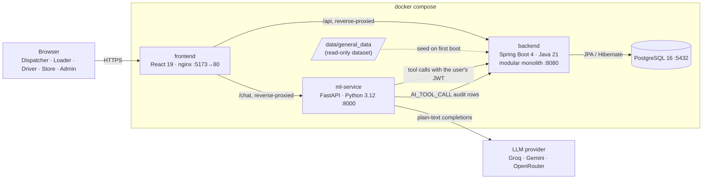

# Architecture

Team Dataverse — Waypoint. One system, four role-specific faces plus an admin area, built as a modular monolith backend with a separate AI service. See the [project README](../README.md) for the problem, setup and walkthrough, and [`../backend/README.md`](../backend/README.md) for the backend in full detail.

## Components

| Component | Responsibility | Notes |
|---|---|---|
| **frontend** | The web app for all five accounts (four roles + admin). React 19, Vite, TypeScript, Tailwind v4, zustand. | Built static, served by nginx in Docker; `npm run dev` with Vite's proxy locally. No business logic — every decision comes from the backend. |
| **backend** | Owns every business rule: the order/trip/delivery state machines, the planning and allocation engine, RBAC, and the audit log. | Spring Boot modular monolith (see [why](../backend/README.md#why-a-modular-monolith)), one PostgreSQL database. |
| **ml-service** | The AI assistant. Translates a natural-language question into one or more role-scoped, read-only backend calls, and a plain-language answer. | Never touches PostgreSQL directly, never holds a backend credential — every call forwards the signed-in user's own JWT, so the backend's own RBAC applies unchanged. |
| **PostgreSQL** | Single source of truth. One schema, Hibernate-managed. | |
| **LLM provider** | Groq, Gemini or OpenRouter, chosen by `LLM_PROVIDER` and swappable without touching `ml-service/app/agent.py`. | Only ever sees the system prompt, the user's message, and tool results the backend already approved. |

## Why this shape

The booklet's framing is "one system, four faces," not four separate apps. A modular monolith backend makes that literal: approving a plan, creating loading tasks, and updating order statuses is one transaction in one database, not a saga across services. The AI service is the one deliberate exception — its runtime (Python, an LLM SDK) is different enough from the Java backend that bundling it in would only add friction, and it has no state of its own to keep transactionally consistent with anything.

## Request paths

- **Browser → frontend → backend**: every screen's data and every action (`POST`, `PATCH`) goes through the backend's REST API with a JWT. The frontend holds no business rules — it reflects what the backend returns and disables what the signed-in role can't do, backed by the backend enforcing the same boundary server-side.
- **Browser → frontend → ml-service → backend**: the AI assistant's path. The assistant reasons in a loop (see the sequence diagram in `backend/README.md`), calling backend endpoints with the user's own JWT and writing an audit row per tool call, then answers in natural language. It cannot write data — no tool in `ml-service/app/tools.py` maps to a mutating endpoint.
- **Offline driver**: when the driver's device loses connectivity, `DRIVER_ARRIVED` and `DELIVERY_OUTCOME` actions are queued on the device instead of sent immediately, each with a client-generated id. On reconnect the queue replays to `POST /api/sync/events` in one batch; the backend applies each by that id, which makes replay idempotent if the same batch is ever sent twice.
- **Driver vehicle selection**: a trip carries no driver assignment — the allocation engine plans against the fleet, not named drivers. `GET /api/driver/trips` lists every dispatched/in-progress trip at the depot; if more than one is active, the frontend asks the driver which vehicle is theirs before any other `/api/driver/*` call can resolve "the" trip, and sends that choice as `tripId` from then on.
- **Order-scoped planning**: `POST /api/planning/generate` takes an optional `{orderIds}` body. The dispatcher's "orders waiting for a plan" list defaults to every confirmed order selected, but can be narrowed — only the ticked orders are considered for that run, everything else stays untouched.

## Deployment

`docker-compose.yml` at the repo root brings up all four services plus Postgres with one command (`docker compose up --build`), seeded with the competition dataset and the five demo accounts on first boot. See [Setup](../README.md#setup) in the project README for the exact steps, including running each service outside Docker for development.
