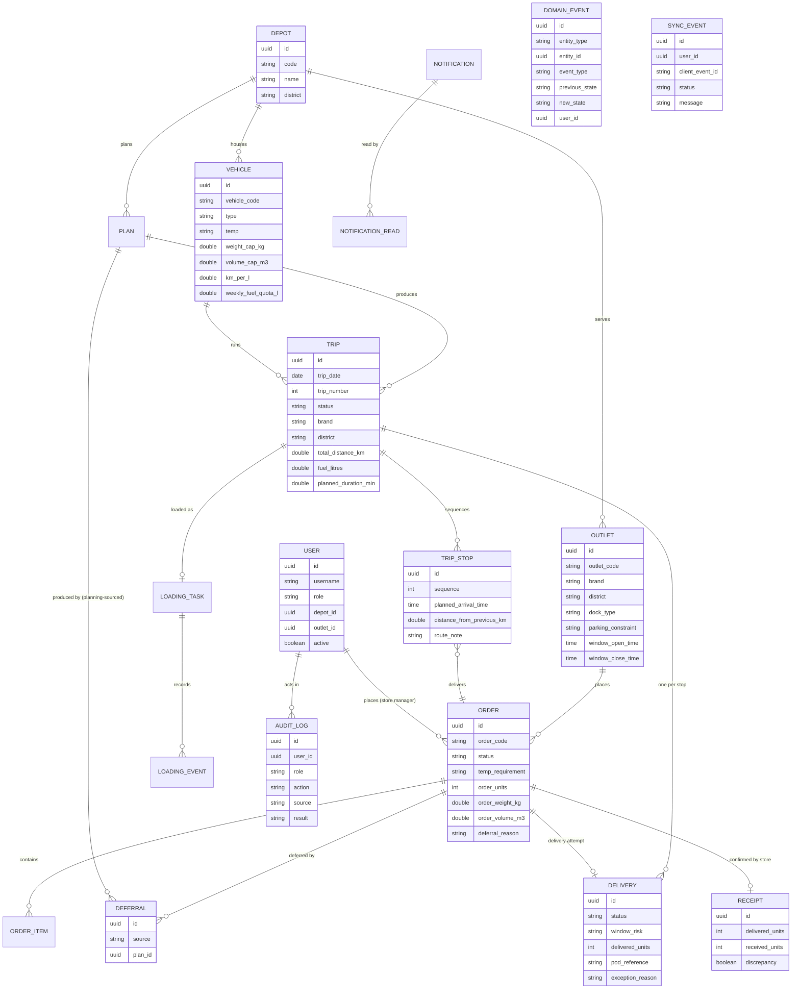

# Data model

One PostgreSQL schema, Hibernate-managed (`ddl-auto: update`). Every table carries `id` (UUID), `created_at` and `updated_at` from a shared `BaseEntity`. See [`backend/README.md`](../backend/README.md#domain-model) for the three state machines these tables drive.

## Entity relationships

## Tables, grouped by what they're for

**Reference data** (loaded once from the competition dataset, read-mostly): `depot`, `outlet`, `vehicle`, `district_travel`, `service_allowance`, `calendar_day`.

**Order lifecycle**: `order`, `order_item`, `deferral`. An order carries its own temperature requirement, units, weight and volume — the allocation engine reads these directly, never infers them. Each `deferral` row records `source` (`PLANNING` or `DISPATCHER`) and, for a planning-sourced one, the `plan_id` of the run that produced it — so a plan's view only ever shows orders *that run* deferred, not every order that happens to be in `DEFERRED` status depot-wide. A manual dispatcher defer has no `plan_id`.

**Planning and execution**: `plan` (one per depot per date, `DRAFT` → `APPROVED` → `SUPERSEDED`), `trip`, `trip_stop`, `loading_task`, `loading_event`, `delivery`, `receipt`. A `trip_stop` is the join between a `trip` and the `order` it carries — `delivery` and `receipt` hang off the order, one attempt and one confirmation each.

**Cross-cutting**: `domain_event` (one row per state transition, across every lifecycle — the timeline the frontend's history views read), `audit_log` (every write, sign-in and AI tool call, independent of `domain_event`), `sync_event` (the driver's offline queue, keyed by a client-generated id so replay is idempotent), `notification` / `notification_read`.

**Identity**: `user` — `role`, `depot_id` (dispatcher/loader/driver) or `outlet_id` (store manager), `active`. A user's `role` plus `depot_id`/`outlet_id` is what every resource-level filter in the backend checks against (see [Security](../backend/README.md#security)).

## Why two separate event logs

`domain_event` and `audit_log` look similar but answer different questions. `domain_event` is the *business* timeline — "this order went from CONFIRMED to PLANNED at this time" — read by the frontend's history views and, indirectly, by the AI assistant's `get_order_status` tool. `audit_log` is the *security and governance* record — who signed in, who ran what mutation, which AI tool call happened and whether it was permitted — read only by the Admin → Audit log screen. Merging them would mean either business users seeing security noise, or admins losing the distinction between "what happened to this order" and "who did it, from where."
